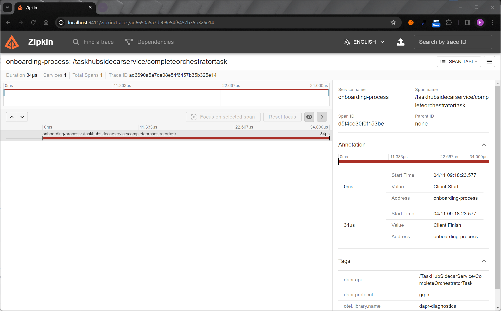

# Dapr Onboarding Workflow

The demo is a simple console application to demonstrate Dapr's workflow programming model and the workflow authoring client. The console app 
starts and manages an organization onboarding process workflow.

This application includes one project:

- Go app `dapr-onboarding` 

The application contains 1 workflow (OnboardingProcessWorkflow) which simulates the process of onboarding a new organization, and 5 unique activities within the workflow. These 5 activities are as follows:

- NotifyActivity: This activity utilizes a logger to print out messages throughout the workflow. These messages notify the user when the onboarding request has been scheduled, also when an error occurs, and more.
- AddUserActivity: This activity is used to process creating users and adding them to the organization. It also assigns users to existing groups.
- VerifyOnboardingActivity: This activity is used to verify if an onboarding request has been correctly scheduled. It does this by checking the state store to ensure that the request has been correctly logged.
- UpdateOnboardingActivity: This activity updates the state store to flag the onbording request as complete.
- RequestApprovalActivity: This activity requests approval from a manager, if the organisation has more than 50 users.

### Run the onboarding process workflow

1. Open a new terminal window and navigate to root of the project, the  `dapr-onboarding` directory.
2. Run the console app with Dapr: 
<!-- STEP
name: Running this example
expected_stdout_lines:
  - "for 10 cars - $150000"
  - "There are 100 cars available for purchase"
  - "Requesting approval for payment of 150000USD for 10 cars"
  - "has been approved!"
  - "There are now 90 cars left in stock"
  - "Workflow completed - result: COMPLETED"
output_match_mode: substring
background: true
timeout_seconds: 120
sleep: 30
-->

```sh
dapr run -f .
```

3. Expected output

```
== APP - order-processor == *** Welcome to the Dapr Workflow console app sample!
== APP - order-processor == *** Using this app, you can place orders that start workflows.
== APP - order-processor == dapr client initializing for: 127.0.0.1:50056
== APP - order-processor == adding base stock item: paperclip
== APP - order-processor == 2024/02/01 12:59:52 work item listener started
== APP - order-processor == INFO: 2024/02/01 12:59:52 starting background processor
== APP - order-processor == adding base stock item: cars
== APP - order-processor == adding base stock item: computers
== APP - order-processor == ==========Begin the purchase of item:==========
== APP - order-processor == NotifyActivity: Received order 48ee83b7-5d80-48d5-97f9-6b372f5480a5 for 10 cars - $150000
== APP - order-processor == VerifyInventoryActivity: Verifying inventory for order 48ee83b7-5d80-48d5-97f9-6b372f5480a5 of 10 cars
== APP - order-processor == VerifyInventoryActivity: There are 100 cars available for purchase
== APP - order-processor == RequestApprovalActivity: Requesting approval for payment of 150000USD for 10 cars
== APP - order-processor == NotifyActivity: Payment for order 48ee83b7-5d80-48d5-97f9-6b372f5480a5 has been approved!
== APP - order-processor == ProcessPaymentActivity: 48ee83b7-5d80-48d5-97f9-6b372f5480a5 for 10 - cars (150000USD)
== APP - order-processor == UpdateInventoryActivity: Checking Inventory for order 48ee83b7-5d80-48d5-97f9-6b372f5480a5 for 10 * cars
== APP - order-processor == UpdateInventoryActivity: There are now 90 cars left in stock
== APP - order-processor == NotifyActivity: Order 48ee83b7-5d80-48d5-97f9-6b372f5480a5 has completed!
== APP - order-processor == Workflow completed - result: COMPLETED
== APP - order-processor == Purchase of item is complete
```

4. Stop Dapr workflow with CTRL-C or:
<!-- END_STEP -->

```sh
dapr stop -f .
```


### View workflow output with Zipkin

For a more detailed view of the workflow activities (duration, progress etc.), try using Zipkin.

1. View Traces in Zipkin UI - In your browser go to http://localhost:9411 to view the workflow trace spans in the Zipkin web UI. The onboarding-process workflow should be viewable with the following output in the Zipkin web UI. Note: the [openzipkin/zipkin](https://hub.docker.com/r/openzipkin/zipkin/) docker container is 
launched on running `dapr init`.



### What happened? 

When you ran the above comands:

1. First the "user" inputs an order for 10 cars into the concole app.
2. A unique order ID for the workflow is generated (in the above example, `b903d749cd814e099f06ebf4a56a2f90`) and the workflow is scheduled.
3. The `NotifyActivity` workflow activity sends a notification saying an order for 10 cars has been received.
4. The `VerifyInventoryActivity` workflow activity checks the inventory data, determines if you can supply the ordered item, and responds with the number of cars 
in stock.
5. The `RequestApprovalActivity` workflow activity is triggered due to buisness logic for orders exceeding $50k and user is prompted to manually approve the 
purchase before continuing the order. 
6. The workflow starts and notifies you of its status.
7. The `ProcessPaymentActivity` workflow activity begins processing payment for order `b903d749cd814e099f06ebf4a56a2f90` and confirms if successful.
8. The `UpdateInventoryActivity` workflow activity updates the inventory with the current available cars after the order has been processed.
9. The `NotifyActivity` workflow activity sends a notification saying that order `b903d749cd814e099f06ebf4a56a2f90` has completed.
10. The workflow terminates as completed.


